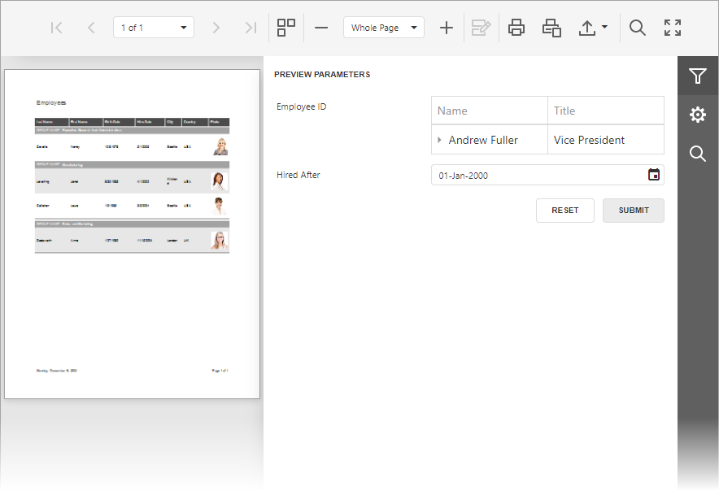

# Customized Parameter Editor in Web Reporting Controls (ASP.NET Core)

This example demonstrates how to customize a standard parameter editor and add a custom editor for a standard parameter type. 

<!-- default file list -->

## Files to Look At

- [HomeController.cs](CS/ParameterEditorAspNetCoreExample/Controllers/HomeController.cs)
- [Viewer.cshtml](CS/ParameterEditorAspNetCoreExample/Views/Home/Viewer.cshtml)
- [Designer.cshtml](CS/ParameterEditorAspNetCoreExample/Views/Home/Designer.cshtml)

<!-- default file list end -->

## Documentation

- [Report Parameters in ASP.NET Core Applications](https://docs.devexpress.com/XtraReports/403203/web-reporting/asp-net-core-reporting/report-parameters-in-asp-net-core-applications)
- [CustomizeParameterEditors Event](https://docs.devexpress.com/XtraReports/DevExpress.AspNetCore.Reporting.WebDocumentViewer.WebDocumentViewerClientSideEventsBuilder.Customize)

## More Examples

- [Custom Report Parameter Types in Web Reporting Controls (ASP.NET Core)](https://github.com/DevExpress-Examples/Reporting-Custom-Parameter-Editor-AspNet-Core)
- [How to use custom report parameter types in web reporting controls](https://github.com/DevExpress-Examples/Reporting_How-to-add-and-use-custom-types-for-report-parameters-in-the-web-reporting-controls)
